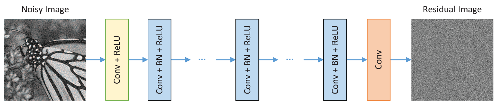

# Image Denoising using Deep Learning

This is a Project on Denoising Images using Deep learning Techniques and comparing the performance with the traditional techniques. We used DnCNN Architecture, used variants of it to evaluate the performance of DnCNN.

## 1.Archiecture
The Architecture consists of three types of layers:
* **Conv+ReLU** :For the first layer, 64 filters of size 3×3×c are used to generate 64 feature maps, and rectified linear units(ReLU) are then utilized for nonlinearity. c represents thenumber of image channels.( for example: c=1forgrayimageandc=3forcolorimage.).
  
* **Conv+BN+ReLU** : for layers 2 to (D−1), 64 filters of size 3×3×64 are used, and batch normalization is added between convolution and ReLU. D is the depth of the architecture.

* **Conv**: for the last layer, c filters of size 3×3×64 are used to reconstruct the output.
  
### 1.1 DnCNN Architecture

#### 1.1.1 Loss Function

#### 1.1.2 Training Loss

